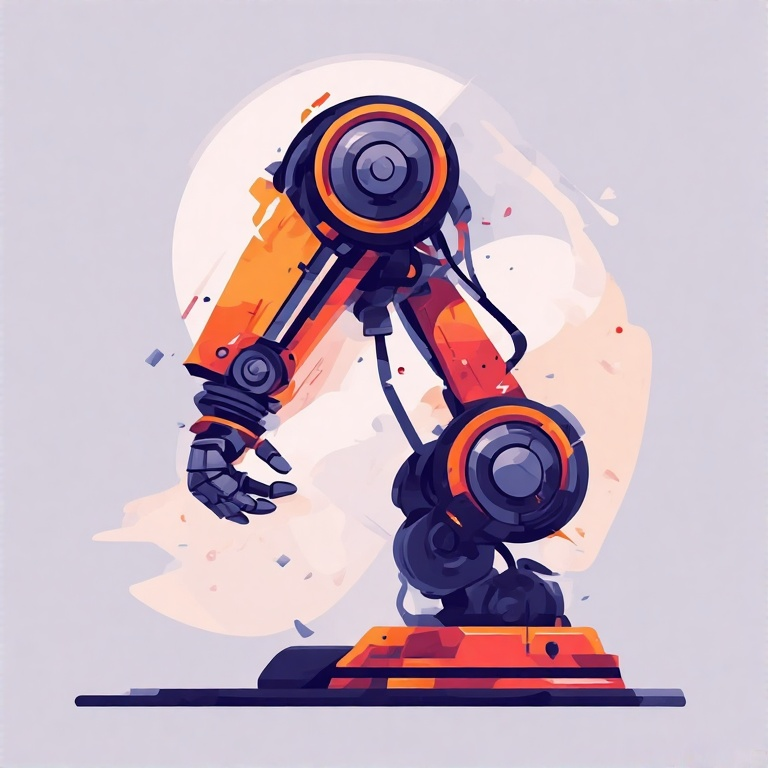

# RoboSandbox for Manipulator Design and Analysis

[](https://github.com/petercorke/robotics-toolbox-python)
[](https://opensource.org/licenses/MIT)
[](https://github.com/chaoyuefei/RoboSandbox/actions?query=workflow%3Aci)
<table style="border:0px">
<tr style="border:0px">
<td style="border:0px">
</td>
<td style="border:0px">
An Open-Source Python Framework for Manipulator Design and Analysis
</td>
</tr>
</table>

<!-- <br> -->

## Contents

- [Synopsis](#1)
- [Tutorials](#3)
- [Code Examples](#4)


<br>

<a id='1'></a>
## Synopsis

RoboSandbox, an open-source Python framework designed for robotic manipulator design and analysis. Different robot models and their workspaces can be evaluated, providing a unified environment for reach, global index, and other performance metrics.

The design goals are:

- **accessibility**: being open-source, documented, and widely tested to ensure reliability and reproducibility, while also providing crossplatform compatibility across Windows, Linux, and MacOS environments.
- **extensibility**: It emphasizes extensibility through a modular structure that facilitates seamless integration of new features and functionalities, such as the addition of extra indices for measuring robotic performance.
- **optimization-driven**: the system supports optimization-driven manipulator design processes through its modular architecture, where submodules can integrate into optimization loops to enable iterative design refinement and evaluation.


## Installation

### Using Pip

You can install RoboSandbox using pip by running the following command:

```bash
pip install robosandbox
```

### Using Conda

It is recommended to use a virtual environment. To set up a [conda](https://docs.conda.io/en/latest/) and [uv](https://docs.astral.sh/uv/getting-started/installation/) environment with RoboSandbox installed, you can use the following commands:

```bash
conda create -n rsb_env python=3.10
conda activate rsb_env
pip install uv
uv pip install robosandbox
```

### Local development installation

To install and develop RoboSandbox, it is recommended to use `uv`, a lightweight and efficient package manager.

After installing uv, you can install RoboSandbox using the following command:

```bash
git clone git@github.com:chaoyuefei/RoboSandbox.git
cd RoboSandbox
uv sync
```

Then you can run the standalone app with:

```bash
uv run src/robosandbox/visualization/app_standalone.py
```

To run the tests, use the following command:

```bash
uv run pytest tests/
```

## Examples

### Standalone App Launch

1. set up a conda environment and install uv as described above:

```bash
conda create -n rsb_env python=3.10
conda activate rsb_env
pip install uv
uv pip install robosandbox
```

2. launch the app with:

```bash
python -c "import robosandbox as rsb; rsb.visualization.RobotArmDesignAppStandalone().run_app()"
```

3. play with the app!


